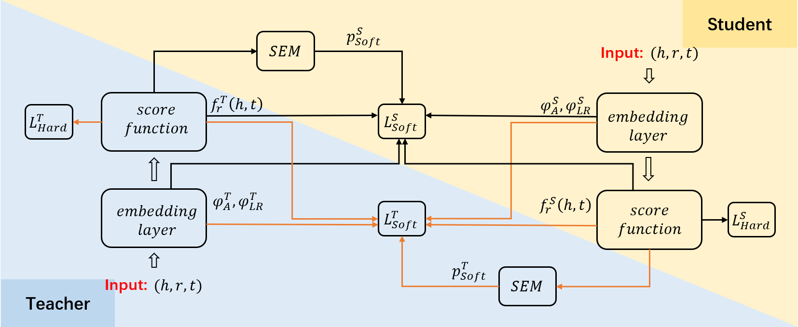

# DualDE: Dually Distilling Knowledge Graph Embedding for Faster and Cheaper Reasoning

This repository is the official implementation of paper: **[DualDE: Dually Distilling Knowledge Graph Embedding for Faster and Cheaper Reasoning](https://dl.acm.org/doi/pdf/10.1145/3488560.3498437)**, accepted by **WSDM 2022** main conference. The project is based on open source framework [NeuralKG](https://github.com/zjukg/NeuralKG), NeuralKG is a python-based library for diverse representation learning of knowledge graphs implementing.


# Brief Introduction
DualDE is a knowledge distillation method to build low-dimensional student KGE from pre-trained high-dimensional teacher KGE. DualDE considers the dual-influence between the teacher and the student. In DualDE, we propose a soft label evaluation mechanism to adaptively assign different soft label and hard label weights to different triples, and a two-stage distillation approach to improve the student’s acceptance of the teacher.

<div align=center>
</div>


# Environment Requirements
To run our code, please install dependency packages.

**Step1** Create a virtual environment using ```Anaconda``` and enter it
```bash
conda create -n neuralkg python=3.8
conda activate neuralkg
```
**Step2** Install the appropriate PyTorch and DGL according to your cuda version

Here we give a sample installation based on cuda == 11.1

+  Install PyTorch
```
pip install torch==1.9.1+cu111 -f https://download.pytorch.org/whl/torch_stable.html
```
+ Install DGL
```
pip install dgl-cu111 dglgo -f https://data.dgl.ai/wheels/repo.html
```

```运行准备
pip install -r requirements.txt
```


# Running

Pretrain a Teacher KGE model：

```预训练Teacher模型
sh scripts/WordNet/ComplEx_WN_pretrain.sh
```

The first stage of distillation：

```第一阶段
sh scripts/WordNet/ComplEx_WN_distil.sh
```

The second stage of distillation：

```第二阶段
sh scripts/WordNet/ComplEx_WN_distil_stage2.sh
```

# Results

Our method achieves the following performance:


| KGE     | Student Dim | Hit@10  | Hit@3 | Hit@1 | MRR   |
| --------| ----------  |-------- | ----- | ----- | ----- | 
| ComplEx | 64        |  0.5  | 0.463 | 0.422  |  0.450 |


The table above shows the results of an instance of the DualDE application, where the KGE method is ComplEx, Teacher model's dimension is 500, and Student model's dimension is 64. And the scripts and results for DualDE applied to other KGE methods (TransE, SimplE, RotatE, etc.) will be released soon.


# Papers for the Project & How to Cite
If you use or extend our work, please cite the following paper:
```
@inproceedings{DBLP:conf/wsdm/ZhuZCCC0C22,
  author    = {Yushan Zhu and
               Wen Zhang and
               Mingyang Chen and
               Hui Chen and
               Xu Cheng and
               Wei Zhang and
               Huajun Chen},
  title     = {DualDE: Dually Distilling Knowledge Graph Embedding for Faster and
               Cheaper Reasoning},
  booktitle = {{WSDM} '22: The Fifteenth {ACM} International Conference on Web Search
               and Data Mining, Virtual Event / Tempe, AZ, USA, February 21 - 25,
               2022},
  pages     = {1516--1524},
  year      = {2022},
  crossref  = {DBLP:conf/wsdm/2022},
  url       = {https://doi.org/10.1145/3488560.3498437},
  doi       = {10.1145/3488560.3498437},
  timestamp = {Sat, 09 Apr 2022 12:34:56 +0200},
  biburl    = {https://dblp.org/rec/conf/wsdm/ZhuZCCC0C22.bib},
  bibsource = {dblp computer science bibliography, https://dblp.org}
}
```

