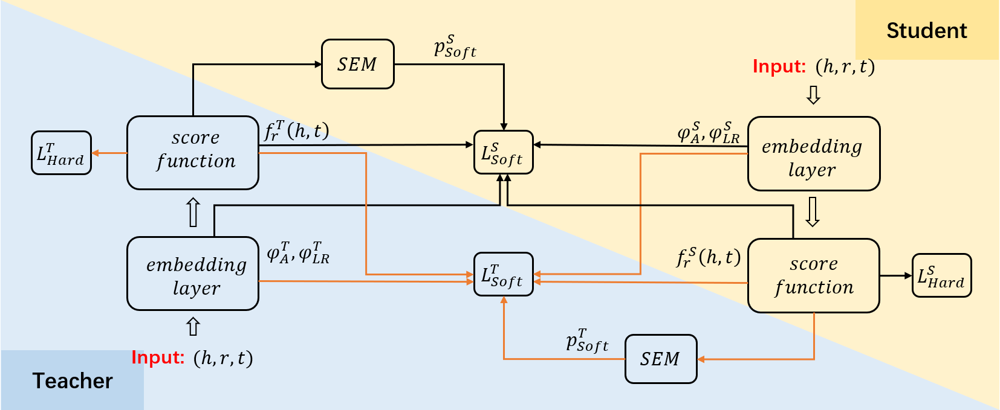

[**中文**](https://github.com/YushanZhu/DistilE/blob/master/README_CN.md) | [**English**](https://github.com/YushanZhu/DistilE)    

<p align="center">
    <a href="https://github.com/zjunlp/openue"> </a>
</p>

# DualDE: 双向蒸馏KGE以实现更快更低成本的推理

这是针对论文 **[DualDE: Dually Distilling Knowledge Graph Embedding for Faster and Cheaper Reasoning](https://dl.acm.org/doi/pdf/10.1145/3488560.3498437)** 的python实现，该论文已被**WSDM 2022**录用。该项目基于开源框架[NeuralKG](https://github.com/zjukg/NeuralKG)，NeuralKG是一个支持多种知识图谱表示学习/知识图谱嵌入（Knowledge Graph Embedding， KGE）模型的Python工具包。

# 项目成员
朱渝珊，张文，陈名杨，陈辉，程旭，张伟，陈华钧。


# 项目简介
DualDE：双向蒸馏KGE以实现更快更低成本的推理。基于软标签评估模块评估蒸馏过程中的软标签的质量，并自适应地对不同三元组分配不同地软标签和硬标签权重。并利用两阶段蒸馏方法提高Teacher模型对Student模型的适合度，进一步提升蒸馏效果。
<div align=center>
</div>


# 环境要求

需要按以下命令去配置项目运行环境：


**Step1** 使用 ```Anaconda``` 创建虚拟环境，并进入虚拟环境

```bash
conda create -n distile python=3.8
conda activate distile
```
**Step2** 下载适用您CUDA版本的的PyTorch的DGL，下面我们提供一个基于CUDA 11.1的下载样例 

+  下载PyTorch
```
pip install torch==1.9.1+cu111 -f https://download.pytorch.org/whl/torch_stable.html
```
+ 下载DGL
```
pip install dgl-cu111 dglgo -f https://data.dgl.ai/wheels/repo.html
```

```运行准备
pip install -r requirements.txt
```


# 运行代码

请运行以下命令来预训练Teacher模型：

```预训练Teacher模型
sh scripts/WordNet/ComplEx_WN_pretrain.sh
```

请运行以下命令来进行Student的第一阶段蒸馏：

```第一阶段
sh scripts/WordNet/ComplEx_WN_distil.sh
```

请运行以下命令来进行Student的第二阶段蒸馏：

```第二阶段
sh scripts/WordNet/ComplEx_WN_distil_stage2.sh
```

# 结果

我们的模型达到了以下的性能：


| KGE     | Student Dim | Hit@10  | Hit@3 | Hit@1 | MRR   |
| --------| ----------  |-------- | ----- | ----- | ----- | 
| ComplEx | 64        |  0.5  | 0.463 | 0.422  |  0.450 |


上表显示了DualDE应用程序的一个实例的结果，其中KGE方法是ComplEx，教师模型的维度是500，学生模型的维度是64。DualDE应用到其他KGE方法(TransE, SimplE, RotatE等)的运行脚本和结果也将很快发布。


## 有关论文

如果您使用或拓展我们的工作，请引用以下论文：

```
@inproceedings{DBLP:conf/wsdm/ZhuZCCC0C22,
  author    = {Yushan Zhu and
               Wen Zhang and
               Mingyang Chen and
               Hui Chen and
               Xu Cheng and
               Wei Zhang and
               Huajun Chen},
  title     = {DualDE: Dually Distilling Knowledge Graph Embedding for Faster and
               Cheaper Reasoning},
  booktitle = {{WSDM} '22: The Fifteenth {ACM} International Conference on Web Search
               and Data Mining, Virtual Event / Tempe, AZ, USA, February 21 - 25,
               2022},
  pages     = {1516--1524},
  year      = {2022},
  crossref  = {DBLP:conf/wsdm/2022},
  url       = {https://doi.org/10.1145/3488560.3498437},
  doi       = {10.1145/3488560.3498437},
  timestamp = {Sat, 09 Apr 2022 12:34:56 +0200},
  biburl    = {https://dblp.org/rec/conf/wsdm/ZhuZCCC0C22.bib},
  bibsource = {dblp computer science bibliography, https://dblp.org}
}
```

## 贡献

>📋  选择一个许可证并描述如何为您的代码存储库做出贡献。

